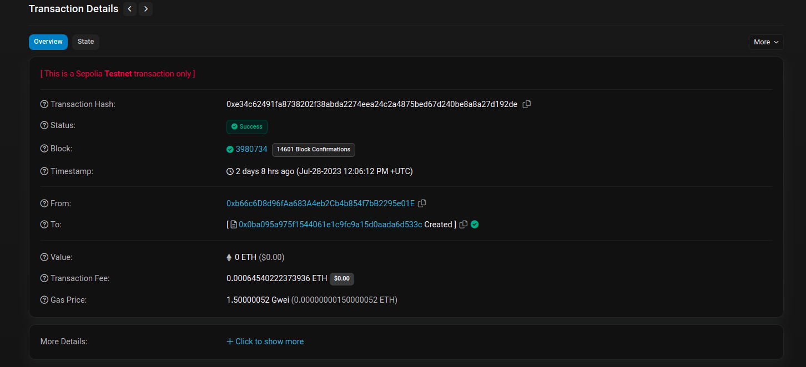
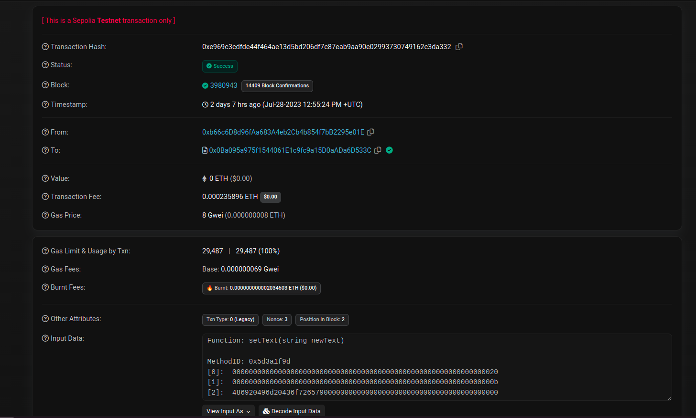
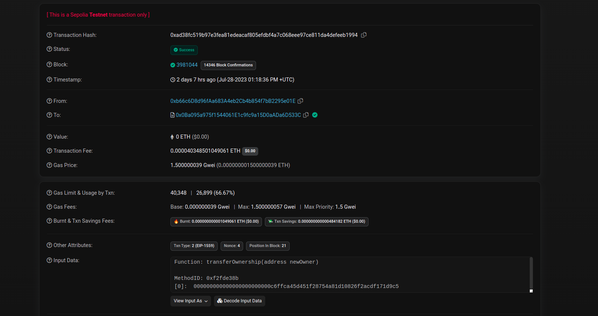
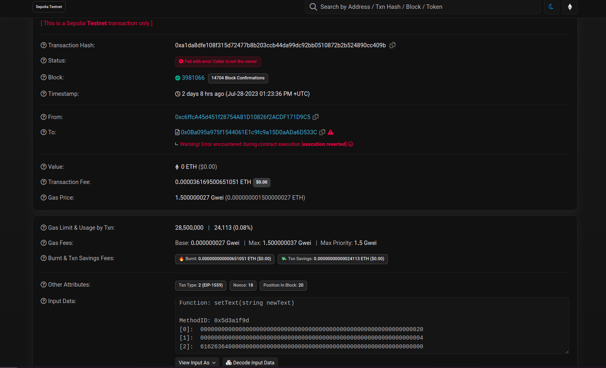
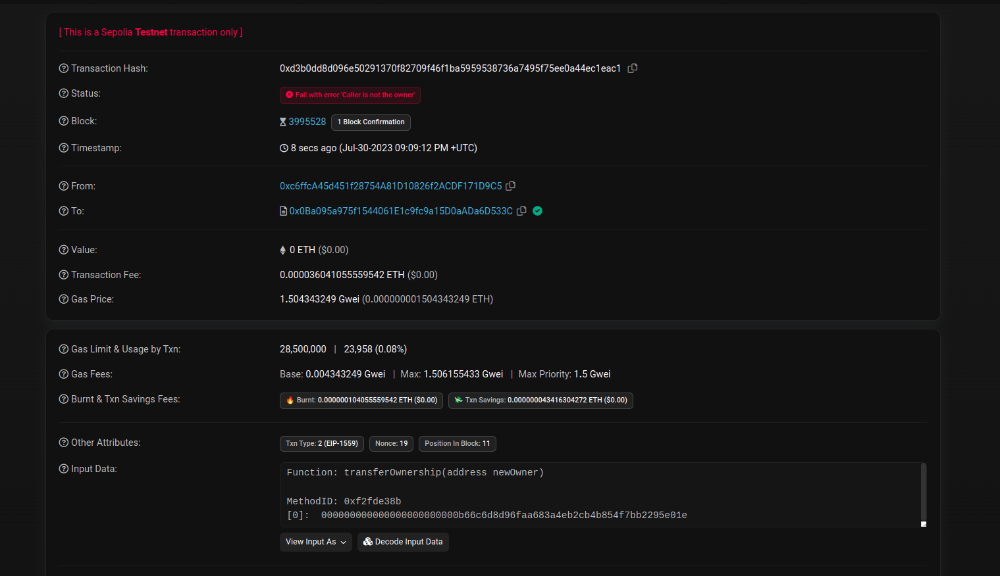
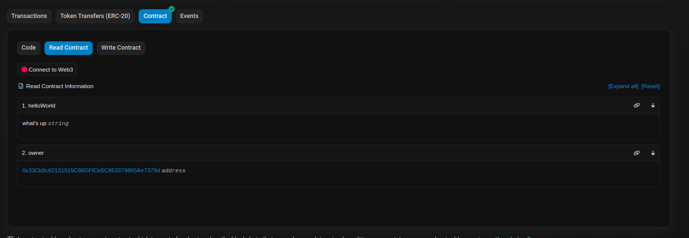

# Ownership In Solidity
In this assignment, we'll try to dig deep into ownership in Solidity,and how the `msg.sender` global variable along with modifiers can be used to create Ownable Contracts. We'll also demonstrate transferring the ownership, using Etherscan as well as Hardhat
### Members

- Deepto (0xc6ffcA45d451f28754A81D10826f2ACDF171D9C5)
- Ken (0x265832C44f412013702761b9bC657CFBCd4cE69a)
- Abdul (0x33Cb9c62131915C86DFfCb5C853379865Ae7379d)
- Sergey (0x2F53eDad37fA7FC72E193d6d708065Bb9f38F4c2)
- maksym
- Corey (0xb66c6D8d96fAa683A4eb2Cb4b854f7bB2295e01E)
  
## Some Background
1. Modifier : A modifier is a special function that is used to modify the behavior of other functions. It has some conditions and `_;` - the merge wildcard symbol. The body of the function (to which the modifier is attached to) will be inserted where the special symbol _; appears in the modifier’s definition. e.g:
    ```
        /// Function that's only accessible to authorized users
        function ReadSensitiveData() public view IsAuthorised returns(bool) {
            //Code ......
            return true;
        }
        function CheckIfAuthorized(address _user) public view returns(bool) {
            // logic that checks that _user is authorised
            return true; 
        }
        modifier IsAuthorised {
            require(CheckIfAuthorized(msg.sender));
            _; // Rest of function call resumes from here
        }
    ```


2. `msg` : msg is a global object in Solidity. It contain properties which allow access to the blockchain.
3. `msg.sender`: It stores the address of the account which executes a function call. When a contract is deployed for the first time, the account executing the deployment is set as msg.sender, subsequently, any account interacting with the contract becomes msg.sender
4. Owner: Although there's no official spec to maintain ownership of a contract, the standard way to do this is to use a state variable e.g `owner`, and set it to `msg.sender` within the constructor. Then we can use a modifier to check ownership and create functions with access restricted to the owner. A standardized example by OpenZeppelin : https://github.com/OpenZeppelin/openzeppelin-contracts/blob/master/contracts/access/Ownable.sol

### Overview:
* [`HelloWorld.sol`](hardhat/contracts//HelloWorld.sol): This is the smart contract we'll use to demonstrate ownership:
    ```
        // SPDX-License-Identifier: GPL-3.0
        pragma solidity >=0.7.0 <0.9.0;
        
        contract HelloWorld {
            string private text;
            address public owner;
        
            constructor() {
                text = "Hello World";
                owner = msg.sender;
            }
    
            /// A function which can be accessed universally
            function helloWorld() public view returns (string memory) {
                return text;
            }
    
            /// A function whose access is restricted to the current owner
            function setText(string calldata newText) public onlyOwner {
                text = newText;
            }
    
            /// A function to transfer ownership of the contract to another address
            function transferOwnership(address newOwner) public onlyOwner {
                owner = newOwner;
            }
    
            /// A modifier to check if the message sender and contract owner are the same
            modifier onlyOwner() 
            {
                require (msg.sender == owner, "Caller is not the owner");
                _;
            }
        }
    ```
* Smart Contract address on Sepolia testnet: [`0x0Ba095a975f1544061E1c9fc9a15D0aADa6D533C`](https://sepolia.etherscan.io/address/0x0ba095a975f1544061e1c9fc9a15d0aada6d533c)

* Transactions: [here](docs/transactions.md)

* [`IHelloWorld.sol`](hardhat/contracts/interfaces/IHelloWorld.sol): contract interface for interaction

* [`HelloWorld.json`](hardhat/deployments/sepolia/HelloWorld.json): contract deployment using [`hardhat-deploy`](https://github.com/wighawag/hardhat-deploy)

## Method 1: Using Etherscan

### How to execute transactions within Etherscan
1. Go to the smart contract url, in our case https://sepolia.etherscan.io/address/0x0ba095a975f1544061e1c9fc9a15d0aada6d533c
2. Go to `Contract` > `Read Contract`/`Write Contract` and follow the steps to connect your wallet
3. Choose a function and pass arguments, then run the function

### Our Methodology
We got on a call and we simulated a bunch of transactions on a contract created by Corey:  
1. Corey (0xb66c6D8d96fAa683A4eb2Cb4b854f7bB2295e01E) creates the contract : https://sepolia.etherscan.io/tx/0xe34c62491fa8738202f38abda2274eea24c2a4875bed67d240be8a8a27d192de

    
2. Currently Corey is the owner, he runs setText(), and changes text to `Hi Im Corey`, and it succeeds: https://sepolia.etherscan.io/tx/0xe969c3cdfde44f464ae13d5bd206df7c87eab9aa90e02993730749162c3da332

    
3. Corey transfers the ownership to Deepto(0xc6ffcA45d451f28754A81D10826f2ACDF171D9C5) : https://sepolia.etherscan.io/tx/0xad38fc519b97e3fea81edeacaf805efdbf4a7c068eee97ce811da4defeeb1994
    
4. Deepto runs setText once, it succeeds, since he's the current owner : https://sepolia.etherscan.io/tx/0x00803bb4355e3d7b05af67439573d6d07fa8e496e25d8cdd8dfa025fb7998ee6
5. Deepto transfers ownership to Ken (0x265832C44f412013702761b9bC657CFBCd4cE69a) : https://sepolia.etherscan.io/tx/0x1b784473e3b99061cfcb9a2255261d96dec3d2da4fa4ee9e91fc2985a44e01d5
6.  Deepto tries running setText again. Since he isn't the owner anymore, this transaction fails: https://sepolia.etherscan.io/tx/0xa1da8dfe108f315d72477b8b203ccb44da99dc92bb0510872b2b524890cc409b
    
7. Ken runs setText as the current owner,  it succeeds : https://sepolia.etherscan.io/tx/0x5927201bdf1861865ffaa039cbc7fa6d4dc96ca6349aac64a5572c9918fa3fc1
8. Ken transfers the ownership to Abdul(0x33Cb9c62131915C86DFfCb5C853379865Ae7379d) : https://sepolia.etherscan.io/tx/0x8adee04d4538df39af6c9ab4b94a15d4ce1c695d0e261031c7b1dbbe58eb1395
9. Abdul runs setText as the owner, it succeeds : https://sepolia.etherscan.io/tx/0xbd360e1c36825351049dc6c4beea07849735318bfaea4c58f6cd8eb8999d22dc
10. Deepto (non-owner) tries to change the ownership to Corey, this fails because the `transferOwnership` function is restricted to the current owner : https://sepolia.etherscan.io/tx/0xd3b0dd8d096e50291370f82709f46f1ba5959538736a7495f75ee0a44ec1eac1
    
11. For all cases, we can read the helloWorld() function (which isn't owned by the owner) and the owner public variable:
    
    
### Our Findings
1. The transactions which failed for us were:
   * Running setText() as a non owner
   * Running transferOwnership() as a non owner
2. This assures us that HelloWorld works as a Ownable Contract where certain functionalities are restricted to the current owner
## Method 2: [Remix](https://remix.ethereum.org)
An alternative solution using Remix

[details](docs/remix.md)

## Method 3: Hardhat

An alternative solution using hardhat-deploy and hardhat tasks

[details](docs/hh.md)


