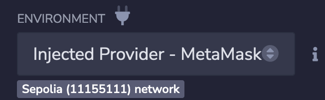
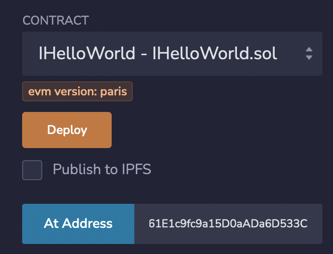
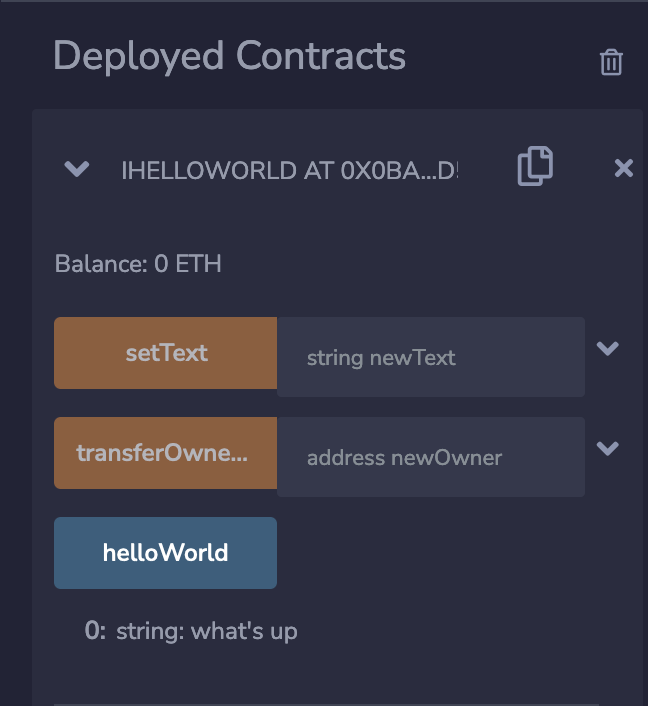

# Interacting smart contract with Remix

1. Set environment to Metamask and switch network to Sepolia testnet

2. Deploy the contract

3. Copy and paste [`IHelloWorld.sol`](../hardhat/contracts/interfaces/IHelloWorld.sol) to Remix workspace

4. Compile and attach the interface to the deployed contract address.

5. Done!

